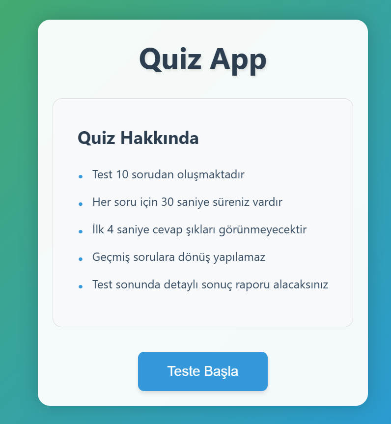
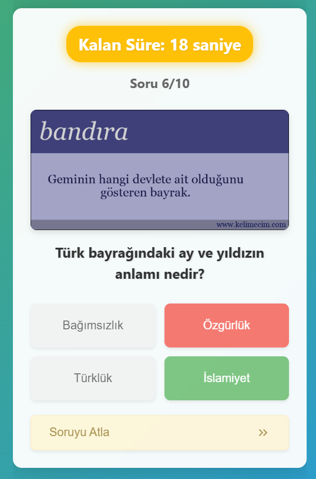
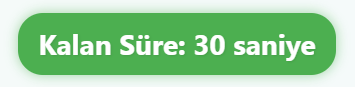
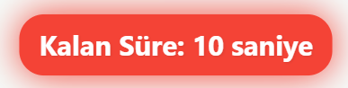
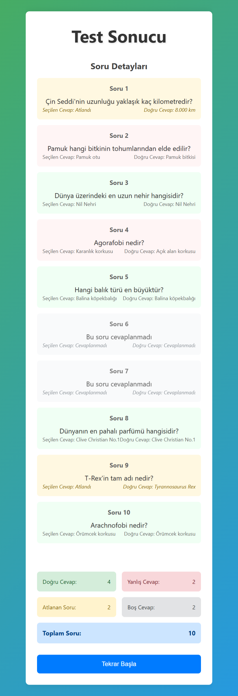

# :question: React Quiz App | React + Vite

[🇹🇷 Click for Turkish README](./README.tr.md)

*Oluşturulma Tarihi : 13 Nisan 2025*

A time-limited, interactive quiz application built with React and Vite.
* This project was developed as **Week-11 / React - Question App | 2nd Final** for the Patika Frontend Bootcamp.
* It is a modern and responsive quiz application.
* Built with **React**, **Vite**, **CSS3**, and **JavaScript**.
* Developed with a component structure and props system.

---

## 🌐 Live Demo

Visit the live site: [Question App | React](https://hafta-11-question-app.vercel.app/)

---

## :computer: Installation & Usage

1. Clone the repository:
```bash
git clone https://github.com/tunahanyasar/question-app-reactjs.git
```

2. Navigate to the project folder:
```bash
cd question-app-reactjs
```

3. Install dependencies:
```bash
npm install
```

4. Start the development server:
```bash
npm run dev
```

---

## 🎮 How to Play?

1. Click the "Start" button on the home page.
2. You have 30 seconds for each question.
3. Select the correct answer:
   - The correct answer is shown in green.
   - The wrong answer is shown in red.
4. The timer color changes according to the remaining time:
   - 20-30 seconds: Green
   - 10-20 seconds: Yellow
   - 0-10 seconds: Red and animated
5. When all questions are finished, you are redirected to the results page.
6. You can see your total score on the results page.

---

## 📜 Project Structure

:open_file_folder: **Folders;**
* *src/*
  * *components/*
    * *Quiz.jsx*
    * *Result.jsx*
    * *StartScreen.jsx*
  * *pages/*
    * *Home.jsx*
    * *Quiz.jsx*
    * *Result.jsx*
  * *styles/*
    * *Home.css*
    * *Quiz.css*
    * *Result.css*
  * *js/*
    * *questions.js*
  * *assets/*
    * *pictures/*
    * *screenshots/*
  * *App.jsx*
  * *App.css*
  * *main.jsx*
* *index.html*
* *package.json*

1. ***src/components/***: Contains React components.
    * **Quiz.jsx**: Main component for quiz logic and UI
    * **Result.jsx**: Component for displaying quiz results
    * **StartScreen.jsx**: Welcome screen before starting the quiz

2. ***src/pages/***: Page components
    * **Home.jsx**: Home page
    * **Quiz.jsx**: Quiz page
    * **Result.jsx**: Results page

3. ***src/styles/***: CSS styles
    * **Home.css**: Home page styles
    * **Quiz.css**: Quiz page styles
    * **Result.css**: Results page styles

4. ***src/js/***: JavaScript helper files
    * **questions.js**: Quiz question database

5. ***src/assets/***: Static files
    * **screenshots/**: Project screenshots

6. ***public/pictures***: Images used in quiz questions

---

## :star2: Features

1. **Quiz Features**
   - Time-limited questions
        - Countdown alert animation.
   - Correct/wrong answer display
   - Scoring system
   - Question transition animations
   - Results page
   - Skip question feature
   - Material Icons integration
   - Detailed results page
     - Number of correct, wrong, empty, and skipped questions
     - Detailed feedback for each question
     - Modern and user-friendly interface
   
2. **Modern UI/UX**
   - Responsive design
   - User-friendly interface
   - Visual feedback
   - Clean and organized codebase
   - Animated transitions
   - Timer animations
   - Answer button effects
---

## 🔄 Latest Updates

1. **Skip Question Feature**
   - "Skip Question >>" button added
   - Material Icons integration
   - Button design and position optimized

2. **Results Page Improvements**
   - Detailed results display added
   - Number of correct, wrong, empty, and skipped questions added
   - Detailed feedback for each question
   - Visual improvements
   - Page layout optimized

3. **General Improvements**
   - Logo set as favicon
   - Page margins adjusted
   - Visual consistency ensured
   - Codebase cleaned and optimized

---

## 💡 Technologies & Concepts

**React:**
* Component Architecture
* Props System
* State Management (useState)
* Event Handling
* Conditional Rendering
* React Router

**CSS:**
* Flexbox Layout
* CSS Animations
* Transform & Transitions
* Responsive Design
* Custom Properties
* Gradient Effects

**JavaScript:**
* ES6+ Features
* Array Methods
* Timers
* Event Handling
* State Management

---

## :paperclip: Screenshots

### Home Page


### Wrong Answer


### Countdown




### Results Page


---

## 📞 Contact

[Tunahan Yaşar](https://github.com/tunahanyasar)

* GitHub: [@tunahanyasar](https://github.com/tunahanyasar)
* LinkedIn: [Tunahan Yaşar](https://www.linkedin.com/in/tunahan-yasar/) 