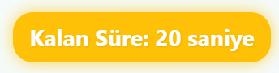

# :question: React Quiz App | React + Vite

Zaman sınırlı, interaktif bir quiz uygulamasıdır. React ve Vite kullanılarak geliştirilmiştir.
* Bu proje, Patika Frontend Bootcamp'i için oluşturulan **Hafta-11 / React - Question App | 2. Final** projesidir.
* Modern ve responsive bir quiz uygulamasıdır.
* **React**, **Vite**, **CSS3** ve **JavaScript** kullanılmıştır.
* Component yapısı ve Props sistemi ile geliştirilmiştir.
* Tamamen responsive tasarıma sahiptir.

* Project Vercel Link : [ https://hafta-11-question-app.vercel.app/ ]

---

## :computer: Kullanım

1. Projeyi klonlayın
```bash
git clone https://github.com/tunahanyasar/Hafta-11-Question-App.git
```

2. Proje klasörüne gidin
```bash
cd Hafta-11-Question App
```

3. Bağımlılıkları yükleyin
```bash
npm install
```

4. Geliştirme sunucusunu başlatın
```bash
npm run dev
```

---

## 📜 Proje Yapısı

:open_file_folder: **Klasörler;**
* *src/*
  * *components/*
    * *Quiz.jsx*
    * *Result.jsx*
    * *StartScreen.jsx*
  * *pages/*
    * *Home.jsx*
    * *Quiz.jsx*
    * *Result.jsx*
  * *styles/*
    * *Home.css*
    * *Quiz.css*
    * *Result.css*
  * *js/*
    * *questions.js*
  * *assets/*
    * *pictures/*
    * *screenshots/*
  * *App.jsx*
  * *App.css*
  * *main.jsx*
* *index.html*
* *package.json*

1. ***src/components/***: React bileşenleri bu klasörde bulunur.
    * **Quiz.jsx**: Quiz mantığını ve görünümünü içeren ana bileşen
    * **Result.jsx**: Quiz sonuçlarını gösteren bileşen
    * **StartScreen.jsx**: Kullanıcıya quiz'e başlamadan önce bir karşılama ekranı sunar.

2. ***src/pages/***: Sayfa bileşenleri
    * **Home.jsx**: Ana sayfa
    * **Quiz.jsx**: Quiz sayfası
    * **Result.jsx**: Sonuç sayfası

3. ***src/styles/***: CSS stilleri
    * **Home.css**: Ana sayfa stilleri
    * **Quiz.css**: Quiz sayfası stilleri
    * **Result.css**: Sonuç sayfası stilleri

4. ***src/js/***: JavaScript yardımcı dosyaları
    * **questions.js**: Quiz sorularının veritabanı

5. ***src/assets/***: Statik dosyalar
    * **pictures/**: Quiz sorularında kullanılan resimler
    * **screenshots/**: Proje ekran görüntüleri

---

## :star2: Özellikler

1. **Quiz Özellikleri**
   - Zaman sınırlı sorular
        - Geri sayımda alert animasyonu.
   - Doğru/yanlış cevap gösterimi
   - Puanlama sistemi
   - Soru geçiş animasyonları
   - Sonuç sayfası
   

2. **Modern UI/UX**
   - Temiz ve modern arayüz
   - Responsive tasarım
   - Animasyonlu geçişler
   - Zamanlayıcı animasyonları
   - Cevap butonu efektleri

3. **İnteraktif Özellikler**
   - Cevap seçimi
   - Zamanlayıcı
   - Puan takibi
   - Sonuç gösterimi
   - Durum bildirimleri

## 💡 Kullanılan Yapılar | Kazanımlar

**React:**
* Component Mimarisi
* Props Sistemi
* State Yönetimi (useState)
* Event Handling
* Conditional Rendering
* React Router

**CSS:**
* Flexbox Layout
* CSS Animations
* Transform & Transitions
* Responsive Design
* Custom Properties
* Gradient Effects

**JavaScript:**
* ES6+ Özellikleri
* Array Metodları
* Zamanlayıcılar
* Event Handling
* State Management

---

## :paperclip: Ekran Görüntüleri

### Ana Sayfa


### Yanlış Cevap


### Geri Sayım




### Sonuç Sayfası


---

## 🎮 Nasıl Oynanır?

1. Ana sayfadan "Başla" butonuna tıklayın.
2. Her soru için 30 saniye süreniz var.
3. Doğru cevabı seçin:
   - Doğru cevap yeşil renkte gösterilir.
   - Yanlış cevap kırmızı renkte gösterilir.
4. Zamanlayıcı durumuna göre renk değişir:
   - 20-30 saniye: Yeşil
   - 10-20 saniye: Sarı
   - 0-10 saniye: Kırmızı ve animasyonlu
5. Tüm sorular bitince sonuç sayfasına yönlendirilirsiniz.
6. Sonuç sayfasında toplam puanınızı görebilirsiniz.

---
