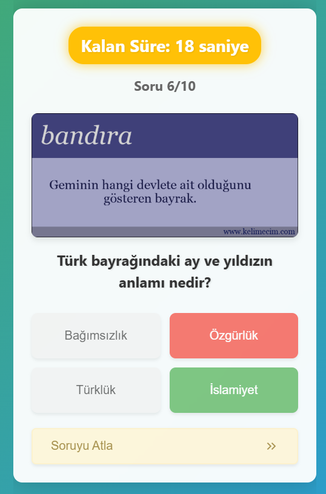
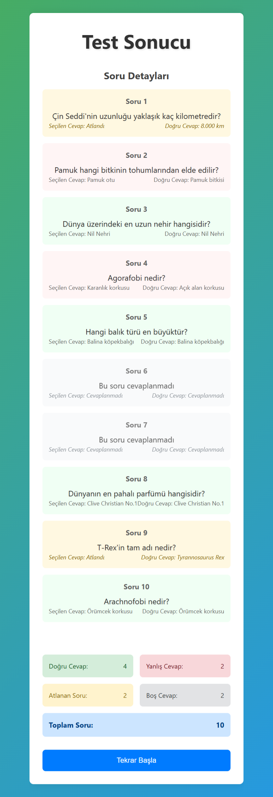

# :question: React Quiz App | React + Vite

[🇬🇧 İngilizce README için tıklayın](./README.md)

*Created on : April 17, 2025*

Zaman sınırlı, interaktif bir quiz uygulamasıdır. React ve Vite kullanılarak geliştirilmiştir.
* Bu proje, Patika Frontend Bootcamp'i için oluşturulan **Hafta-11 / React - Question App | 2. Final** projesidir.
* Modern ve responsive bir quiz uygulamasıdır.
* **React**, **Vite**, **CSS3** ve **JavaScript** kullanılmıştır.
* Component yapısı ve Props sistemi ile geliştirilmiştir.

---

## 🌐 Canlı Demo

Canlı siteyi ziyaret edin: [Question App | React](https://hafta-11-question-app.vercel.app/)

---

## :computer: Kullanım

1. Projeyi klonlayın
```bash
git clone https://github.com/tunahanyasar/question-app-reactjs.git
```

2. Proje klasörüne gidin
```bash
cd question-app-reactjs
```

3. Bağımlılıkları yükleyin
```bash
npm install
```

4. Geliştirme sunucusunu başlatın
```bash
npm run dev
```

---

## 🎮 Nasıl Oynanır?

1. Ana sayfadan "Başla" butonuna tıklayın.
2. Her soru için 30 saniye süreniz var.
3. Doğru cevabı seçin:
   - Doğru cevap yeşil renkte gösterilir.
   - Yanlış cevap kırmızı renkte gösterilir.
4. Zamanlayıcı durumuna göre renk değişir:
   - 20-30 saniye: Yeşil
   - 10-20 saniye: Sarı
   - 0-10 saniye: Kırmızı ve animasyonlu
5. Tüm sorular bitince sonuç sayfasına yönlendirilirsiniz.
6. Sonuç sayfasında toplam puanınızı görebilirsiniz.

---

## 📜 Proje Yapısı

:open_file_folder: **Klasörler;**
* *src/*
  * *components/*
    * *Quiz.jsx*
    * *Result.jsx*
    * *StartScreen.jsx*
  * *pages/*
    * *Home.jsx*
    * *Quiz.jsx*
    * *Result.jsx*
  * *styles/*
    * *Home.css*
    * *Quiz.css*
    * *Result.css*
  * *js/*
    * *questions.js*
  * *assets/*
    * *pictures/*
    * *screenshots/*
  * *App.jsx*
  * *App.css*
  * *main.jsx*
* *index.html*
* *package.json*

1. ***src/components/***: React bileşenleri bu klasörde bulunur.
    * **Quiz.jsx**: Quiz mantığını ve görünümünü içeren ana bileşen
    * **Result.jsx**: Quiz sonuçlarını gösteren bileşen
    * **StartScreen.jsx**: Kullanıcıya quiz'e başlamadan önce bir karşılama ekranı sunar.

2. ***src/pages/***: Sayfa bileşenleri
    * **Home.jsx**: Ana sayfa
    * **Quiz.jsx**: Quiz sayfası
    * **Result.jsx**: Sonuç sayfası

3. ***src/styles/***: CSS stilleri
    * **Home.css**: Ana sayfa stilleri
    * **Quiz.css**: Quiz sayfası stilleri
    * **Result.css**: Sonuç sayfası stilleri

4. ***src/js/***: JavaScript yardımcı dosyaları
    * **questions.js**: Quiz sorularının veritabanı

5. ***src/assets/***: Statik dosyalar
    * **screenshots/**: Proje ekran görüntüleri

6. ***public/pictures***: Quiz sorularında kullanılan resimler

---

## :star2: Özellikler

1. **Quiz Özellikleri**
   - Zaman sınırlı sorular
        - Geri sayımda alert animasyonu.
   - Doğru/yanlış cevap gösterimi
   - Puanlama sistemi
   - Soru geçiş animasyonları
   - Sonuç sayfası
   - Soru atlama özelliği
   - Material Icons entegrasyonu
   - Detaylı sonuç sayfası
     - Doğru, yanlış, boş ve atlanan soru sayıları
     - Her soru için detaylı geri bildirim
     - Modern ve kullanıcı dostu arayüz
   
2. **Modern UI/UX**
   - Responsive tasarım
   - Kullanıcı dostu arayüz
   - Görsel geri bildirimler
   - Temiz ve düzenli kod yapısı
   - Animasyonlu geçişler
   - Zamanlayıcı animasyonları
   - Cevap butonu efektleri
---

## 🔄 Son Güncellemeler

1. **Soru Atlama Özelliği**
   - "Soruyu Atla >>" butonu eklendi
   - Material Icons entegrasyonu yapıldı
   - Buton tasarımı ve konumu optimize edildi

2. **Sonuç Sayfası İyileştirmeleri**
   - Detaylı sonuç gösterimi eklendi
   - Doğru, yanlış, boş ve atlanan soru sayıları eklendi
   - Her soru için detaylı geri bildirim eklendi
   - Görsel iyileştirmeler yapıldı
   - Sayfa düzeni optimize edildi

3. **Genel İyileştirmeler**
   - Logo favicon olarak ayarlandı
   - Sayfa kenar boşlukları düzenlendi
   - Görsel tutarlılık sağlandı
   - Kod yapısı temizlendi ve optimize edildi

---

## 💡 Kullanılan Yapılar | Kazanımlar

**React:**
* Component Mimarisi
* Props Sistemi
* State Yönetimi (useState)
* Event Handling
* Conditional Rendering
* React Router

**CSS:**
* Flexbox Layout
* CSS Animations
* Transform & Transitions
* Responsive Design
* Custom Properties
* Gradient Effects

**JavaScript:**
* ES6+ Özellikleri
* Array Metodları
* Zamanlayıcılar
* Event Handling
* State Management

---

## :paperclip: Ekran Görüntüleri

### Ana Sayfa


### Yanlış Cevap


### Geri Sayım


### Sonuç Sayfası



---

## 📞 İletişim

[Tunahan Yaşar](https://github.com/tunahanyasar)

* GitHub: [@tunahanyasar](https://github.com/tunahanyasar)
* LinkedIn: [Tunahan Yaşar](https://www.linkedin.com/in/tunahan-yasar/) 